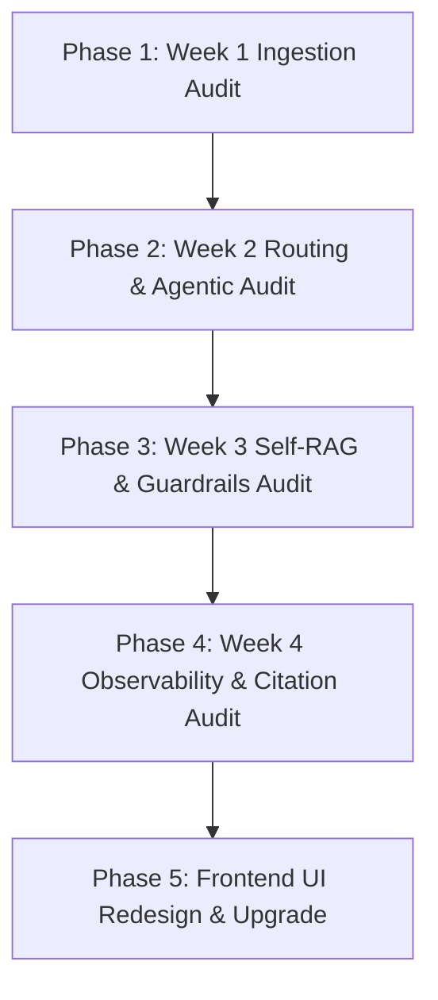

# 📋 OmniBrain Week-by-Week Integration Test Sequence & Loophole Audit Plan

## 1. Executive Summary & Audit Goals

- **Ultimate Goal**: Validate OmniBrain as a production-grade Agentic AI system capable of autonomous reasoning over multi-modal unstructured data with enterprise-grade hallucination resistance.
- **Strategy**: Perform a systematic weekly regression & integration audit from Week 1 to Week 4, identifying technical loopholes, edge cases, and failure modes across the backend & agentic architecture before proceeding to Frontend UI redesign.

---

## 2. Weekly Test Sequence & Loophole Audit Matrix

### Week 1: Multi-Modal Ingestion & Vector Storage Pipeline
* **Core Capabilities Tested**: PDF parsing (`PyMuPDF`), text chunking (`RecursiveCharacterTextSplitter`), visual figure extraction, `BAAI/bge-small-en-v1.5` text embeddings, `CLIP` image embeddings, Qdrant payload indexing.
* **Verification Test Steps**:
  1. Synchronous PDF Upload endpoint (`POST /api/v1/ingestion/upload`).
  2. Text chunk payload validation (`chunk_id`, `page_number`, `source`, `document_id`).
  3. Image vector embedding size (512-dim CLIP vectors) & metadata payload checks.
  4. Qdrant payload filtering performance (< 150ms lookup).
* **Potential Loopholes / Edge Cases to Uncover**:
  - **Memory Leaks on Large PDFs**: High RAM spikes when parsing 100+ page PDFs.
  - **Scanned / OCR-only PDFs**: Zero text extracted if PDF contains scanned image pages without OCR fallback.
  - **Duplicate Asset Storage**: Uploading the exact same PDF twice filling up Qdrant storage with redundant points.
  - **Special Characters in Filenames**: Spaces, accents, parentheses in PDF file names breaking asset URLs or Starlette static mounts.

---

### Week 2: Agentic Architecture & Supervisor Routing
* **Core Capabilities Tested**: LangGraph state machine flow, `AgentState` schema, `Supervisor` router node, worker agents (`text_agent`, `vision_agent`, `sql_agent`, `web_agent`).
* **Verification Test Steps**:
  1. Routing accuracy over complex intent variations (text vs vision vs SQL vs web search).
  2. Multi-agent state propagation (`thought_process`, `retrieved_text`, `retrieved_images`).
  3. Deterministic heuristic fallback routing when LLM key is absent or rate-limited (429).
* **Potential Loopholes / Edge Cases to Uncover**:
  - **Supervisor Misrouting**: Queries containing ambiguous keywords (e.g. "show me table 2" routing to `sql_agent` instead of `text_agent`/`vision_agent`).
  - **State Bloat**: Multi-turn chat messages ballooning `AgentState` size beyond LLM context windows.
  - **State Loss on Exception**: Router throwing unhandled exception on malformed JSON response, stranding graph execution.

---

### Week 3: Self-RAG Re-Query Loop & NeMo Guardrails
* **Core Capabilities Tested**: Relevance grader evaluator, Query Rewriter node, re-query vector search, NeMo Guardrails (`check_input`, `check_output`), regex pattern fallback safety net.
* **Verification Test Steps**:
  1. Low relevance detection (retrieval score < 0.70) triggering automatic re-query loop.
  2. Query rewriter query expansion (`query + source document keywords`).
  3. 60-prompt Guardrails safety suite (`scripts/test_guardrails_suite.py`) testing jailbreaks, out-of-scope prompts, toxic outputs.
* **Potential Loopholes / Edge Cases to Uncover**:
  - **Infinite Re-query Loops**: Re-querying continuously if rewritten query score remains < 0.70 without a maximum retry cap (`retry_count >= 3`).
  - **Over-Aggressive Guardrails**: False positive blocks on valid technical queries containing keywords like "exploit", "attack surface", or "vulnerability".
  - **Prompt Drift in Rewriter**: Rewriter modifying query intent so heavily that the second search retrieves irrelevant documents.

---

### Week 4: Observability, Citations & Enterprise Precision
* **Core Capabilities Tested**: Langfuse telemetry tracing (`CallbackHandler`), structured citation generator (`claim`, `source_pdf`, `page`, `chart_id`), active document scoped filtering.
* **Verification Test Steps**:
  1. Langfuse session metrics logging (token counts, latency, cost estimation).
  2. Citation payload accuracy (linking claims to exact PDF page numbers and chart IDs).
  3. Scoped document filtering (`source == active_document`) preventing cross-PDF context leakage.
* **Potential Loopholes / Edge Cases to Uncover**:
  - **Citation Hallucination**: Citation generator assigning a valid claim to an incorrect page number or wrong document.
  - **Telemetry Overhead**: Network latency overhead during Langfuse callback sync blocking FastAPI execution.
  - **Missing Source Badges**: Missing or null `source` metadata on legacy indexed points causing UI badge rendering errors.

---

## 3. Recommended PDF Test Assets & Data Sources

To thoroughly test OmniBrain across all modalities and edge cases, download and test with these standard benchmark PDFs:

1. **Complex Multi-Modal Financial Report**:
   * *Recommended File*: **Apple Inc. 2023 Form 10-K Annual Report** or **Tesla 2023 Q4 Investor Deck** (PDF with multi-column text, financial tables, balance sheets, and bar charts).
   * *Test Intent*: Tests multi-page text retrieval + VLM chart analysis + structured table extraction in a single document.
2. **Dense Academic Technical Paper**:
   * *Recommended File*: **"Attention Is All You Need" (Vaswani et al., 2017)** (PDF with mathematical equations, architecture diagrams, and benchmark performance tables).
   * *Test Intent*: Tests technical term matching, transformer diagram visual retrieval, and citation page precision.
3. **Scanned / Image-Heavy Document**:
   * *Recommended File*: **US Patent Sample PDF** or **Scanned Invoice PDF** (Image-based PDF without embedded text layers).
   * *Test Intent*: Tests OCR fallback and image extraction resilience.
4. **Structured SQL Test Database**:
   * *File Location*: `data/omnibrain_stock.db` (Historical SQLite database containing `stock_metrics`, `daily_prices`, `company_profiles`).
   * *Test Intent*: Tests Text-to-SQL query generation, schema validation, and SQL table rendering.

---

## 4. Execution Roadmap & Phases

## 5. User Review Required

> [!IMPORTANT]
> **Sequential Execution Protocol**: Review this weekly audit plan. Once approved, we will begin executing **Phase 1: Week 1 Ingestion Audit** step-by-step without modifying code until explicit test instructions are provided.
